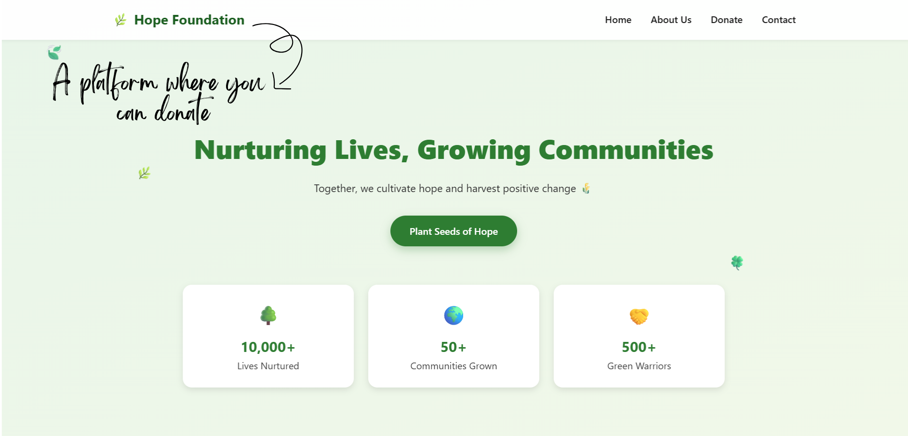
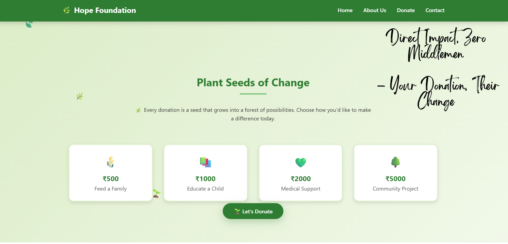
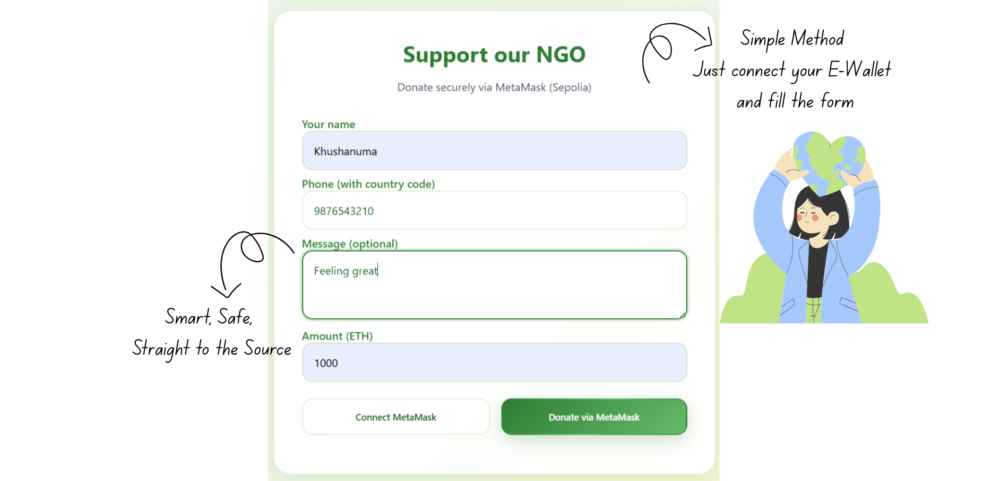
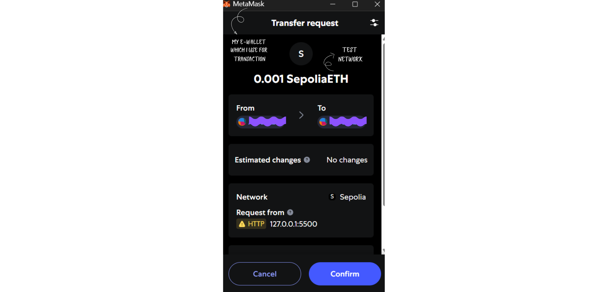
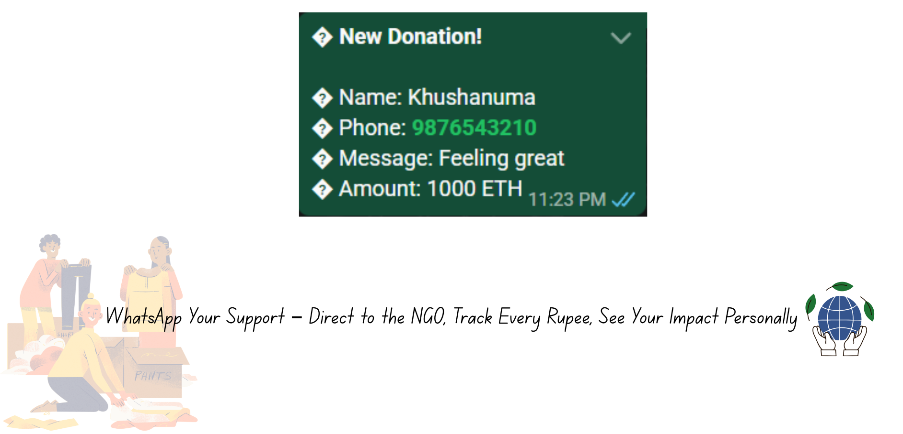

<h1 align="center">💙 DonateChain</h1>

  

  

---

### 👩‍💻 About the Project

**DonateChain** is a blockchain-powered donation platform designed to bring **trust, transparency, and real impact** to charity.

Instead of wondering where your money goes, DonateChain ensures:
👉 Every donation is **trackable**  
👉 Every transaction is **secure & immutable**  
👉 Every donor sees the **real-world impact**

> *"Donating should feel as transparent as tracking a pizza delivery 🍕"*

---

### 📸 Website Preview

#### 🔹 Home Page  

   
  

---

#### 🔹 Donation Page  

  

---

#### 🔹 Blockchain Transaction  

  

---

#### 🔹 NGO Contact / WhatsApp  

  

---

### ✨ Key Features

✅ Blockchain-based donation system (Sepolia ETH Testnet)  
✅ MetaMask wallet integration  
✅ Transparent & immutable transactions  
✅ Direct NGO communication via WhatsApp  
✅ Real-time impact proof (photos, updates)  
✅ No middlemen or hidden charges  

---

### ⚙️ Tech Stack

| Category | Technologies Used |
|----------|------------------|
| **Frontend** | HTML, CSS, JavaScript |
| **Blockchain** | Ethereum (Sepolia Testnet) |
| **Wallet** | MetaMask |
| **Backend** | Node.js |
| **Version Control** | Git & GitHub |

---

### 🧠 How It Works

- Connect MetaMask wallet  
- Donate using blockchain  
- Transaction gets permanently stored  
- NGO receives funds directly  
- Donor gets proof of impact  

💙 **No banks. No middlemen. Just YOU → THEM.**

---

### 🚀 Inspiration

I once donated and thought:

*"Did my money actually reach someone?"*

That question led to **DonateChain**.

Now imagine:
📱 You donate ₹500  
💬 You get a WhatsApp message  
📸 A real photo of impact  

That’s what this project makes possible.

---

### 🧑‍🎓 Author

**Khushanuma Shabbir Mansuri**  
📍 B.Tech IT Student | Developer  
📧 khushanuma.shabbir@gmail.com  
🌐 [LinkedIn](https://www.linkedin.com/in/khushanuma-mansuri-7b0789292/)

---

### 🏆 Achievements

- Built a blockchain-based donation platform  
- Integrated MetaMask payments  
- Created a transparency-focused system  
- Focused on real-world social impact  

---

### 💎 Badges

---

⭐ *If you believe in transparent charity, give this repo a star!* ⭐
