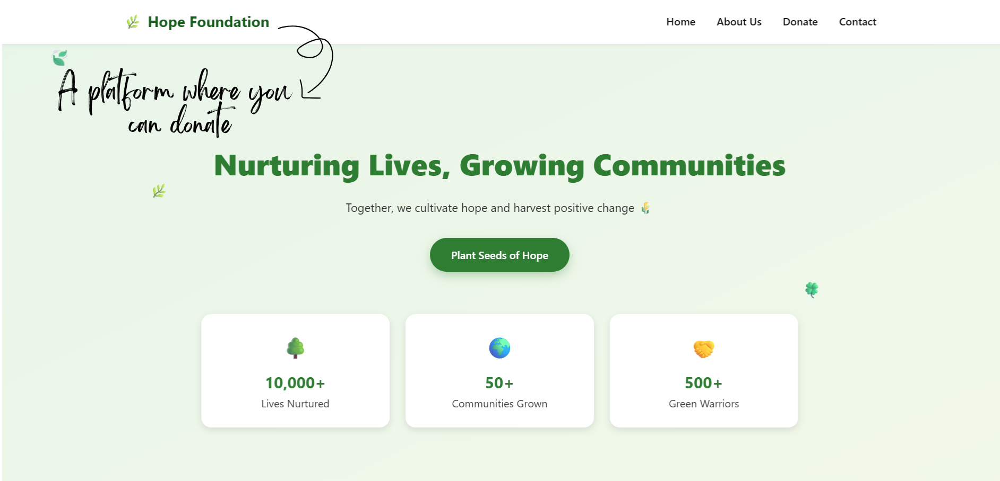
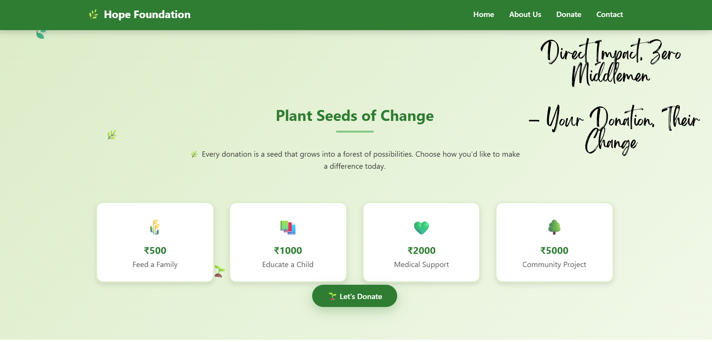
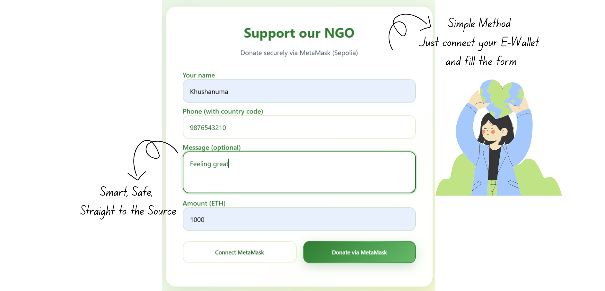
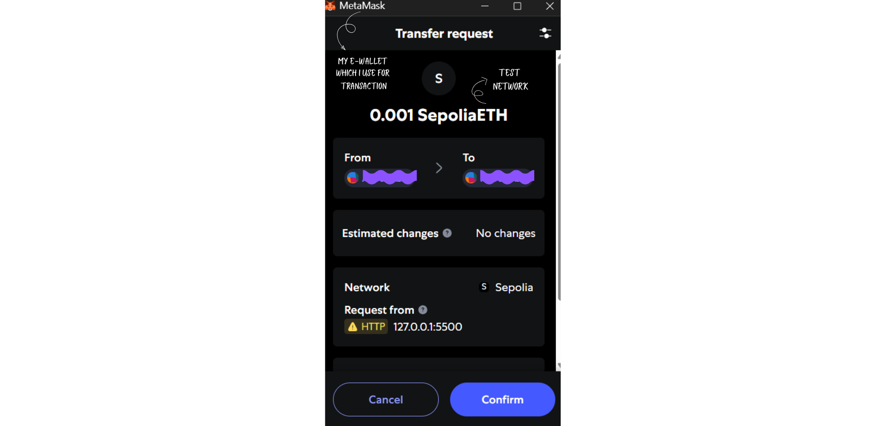
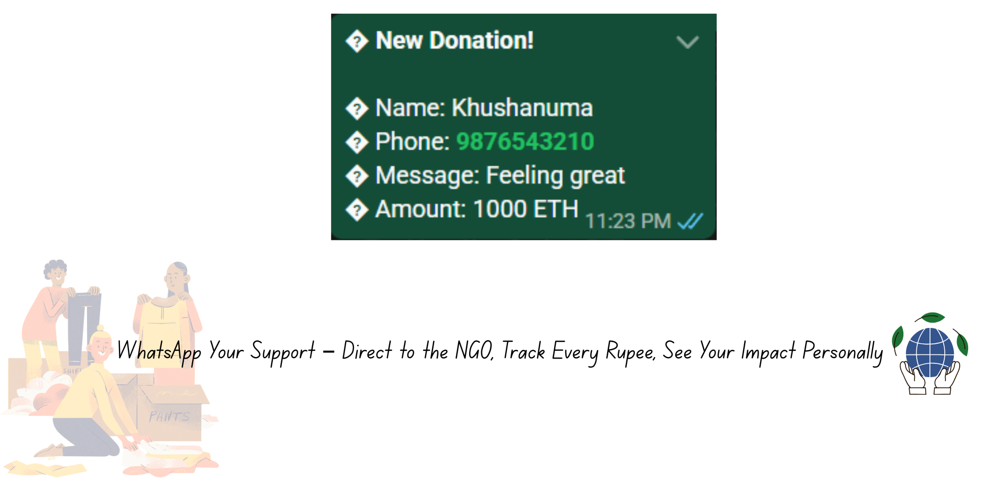

<h1 align="center">DonateChain 💙</h1>

<p align="center">
  
</p>

<p align="center">
  
</p>

---

## 📖 Project Overview

DonateChain is a blockchain-powered donation platform designed to improve transparency, accountability, and trust in charitable giving.

Traditional donation systems often leave donors uncertain about where their contributions go and whether the intended beneficiaries actually receive support. DonateChain addresses this challenge by leveraging blockchain technology, secure donation tracking, and direct NGO communication.

The platform enables donors to contribute through MetaMask, records transactions on the Ethereum Sepolia Testnet, stores donation information securely, and facilitates communication between NGOs and donors.

> "Donating should feel as transparent as tracking a pizza delivery 🍕"

---

## 🎯 Problem Statement

Millions of people donate every year, yet donors frequently face several challenges:

* Lack of transparency regarding fund utilization.
* Difficulty tracking donations after payment.
* Limited communication between NGOs and donors.
* Dependence on intermediaries.
* Absence of verifiable proof of impact.

These issues reduce donor confidence and can discourage future contributions.

---

## 💡 Proposed Solution

DonateChain provides a transparent and traceable donation ecosystem.

The platform allows donors to:

* Connect their MetaMask wallet.
* Make donations using blockchain technology.
* Track donation records.
* Communicate directly with NGOs.
* Receive proof of impact and updates.

Every transaction becomes transparent, verifiable, and immutable.

---

<h2 align="center">🏗️ System Architecture</h2>

<p align="center">
User
<br>⬇️
<br>Landing Website (Hope.html)
<br>⬇️
<br>Donation Portal
<br>⬇️
<br>MetaMask Wallet
<br>⬇️
<br>Ethereum Sepolia Blockchain
<br>⬇️
<br>Node.js Backend
<br>⬇️
<br>MongoDB Database
<br>⬇️
<br>NGO Communication Layer
<br>⬇️
<br>WhatsApp Updates
</p>

## 🔄 Working Flow

### Step 1: Visit Platform

Users land on the DonateChain website and learn about ongoing causes and donation opportunities.

### Step 2: Connect Wallet

Users connect their MetaMask wallet to authorize blockchain transactions.

### Step 3: Make Donation

The donation amount is transferred through Ethereum's Sepolia Testnet.

### Step 4: Record Transaction

The transaction details are captured and stored securely.

### Step 5: Store Donor Information

Donation information is maintained in MongoDB for future reference and tracking.

### Step 6: NGO Communication

NGOs can receive donation notifications and communicate with donors through WhatsApp integration.

### Step 7: Impact Verification

Donors receive updates and proof regarding how their contributions created impact.

---

## 📸 Application Screenshots

### 🏠 Landing Page

<p align="center">
  
  
</p>

---

### 💰 Donation Interface

<p align="center">
  
</p>

---

### ⛓️ Blockchain Transaction

<p align="center">
  
</p>

---

### 📱 NGO Communication

<p align="center">
  
</p>

---
## 🔑 Prerequisites

Before running DonateChain, ensure the following requirements are met:

### 1. MetaMask Wallet

* Install the MetaMask browser extension.
* Create a new wallet or import an existing one.

### 2. Ethereum Sepolia Testnet

* Switch MetaMask to the **Sepolia Test Network**.
* DonateChain is currently configured to operate on Sepolia for testing and demonstration purposes.

### 3. Sepolia Test ETH

* The donor wallet must contain Sepolia test ETH.
* Test ETH can be obtained from public Sepolia faucets.

### 4. Internet Connection

* Required for blockchain transactions, backend communication, and database connectivity.

---

## ⚠️ Important Notice

This project uses the **Ethereum Sepolia Testnet** and **MetaMask Wallet Integration**.

For the donation workflow to function correctly:

* MetaMask must be installed and connected.
* MetaMask must be switched to the Sepolia Testnet.
* The donor wallet must have sufficient Sepolia test ETH to cover transaction costs.
* Transactions will not work on Ethereum Mainnet or other networks unless the application is reconfigured.

Without these prerequisites, blockchain donations cannot be completed successfully.

---

## 🌐 Live Demo

Frontend (Vercel):
https://donatechain-bt.vercel.app/

Backend API (Render):
https://donatechain.onrender.com/

> Note: Render free-tier services may take a few seconds to wake up after inactivity.

---

## ✨ Key Features

### Blockchain Transparency

* Ethereum-based donation transactions
* Immutable transaction history
* Public verification capability

### Secure Payments

* MetaMask wallet integration
* Blockchain transaction authorization
* Secure donation workflow

### Donation Management

* Donation record storage
* Donor information management
* Transaction tracking

### NGO Communication

* WhatsApp integration
* Donor engagement
* Direct communication channel

### User Experience

* Clean and responsive interface
* Easy donation process
* Transparent workflow

---

## ⚙️ Technology Stack

| Category               | Technologies               |
| ---------------------- | -------------------------- |
| Frontend               | HTML, CSS, JavaScript      |
| Backend                | Node.js, Express.js        |
| Database               | MongoDB, Mongoose          |
| Blockchain             | Ethereum (Sepolia Testnet) |
| Wallet Integration     | MetaMask                   |
| Communication          | WhatsApp Web.js            |
| Environment Management | dotenv                     |
| Version Control        | Git & GitHub               |

---

## 📂 Project Structure

```text
DonateChain/
│
├── DonationPage/
│   ├── models/
│   │   └── Donation.js
│   ├── server.js
│   ├── index.html
│   ├── script.js
│   ├── style.css
│   ├── package.json
│   └── .env
│
├── image/
│
├── Hope.html
├── Hopescript.js
├── Hopestyle.css
├── README.md
└── .gitignore
```

---

## 🚀 Installation & Setup

### Clone Repository

```bash
git clone <repository-url>
```

### Navigate to Project

```bash
cd DonateChain/DonationPage
```

### Install Dependencies

```bash
npm install
```

### Configure Environment Variables

Create a `.env` file and add required credentials.

### Start Server

```bash
npm start
```

Server will run on:

```text
http://localhost:3000
```

---

## 🔮 Future Enhancements

* Smart Contract Deployment on Ethereum Mainnet
* NGO Verification System
* Donor Dashboard
* AI-Based Impact Analysis
* Multi-NGO Support
* Real-Time Donation Analytics
* NFT-Based Donation Certificates
* Blockchain Explorer Integration
* Mobile Application Development

---

## 🏆 Learning Outcomes

Through this project, I gained practical experience in:

* Blockchain-based application development
* Ethereum transaction workflows
* MetaMask integration
* Backend API development
* MongoDB database management
* WhatsApp automation
* Full-stack web development
* Git and GitHub collaboration

---

## 👩‍💻 Author

**Khushanuma Shabbir Mansuri**

B.Tech Information Technology Student

Email: [khushanuma.shabbir@gmail.com](mailto:khushanuma.shabbir@gmail.com)

LinkedIn: https://www.linkedin.com/in/khushanuma-mansuri-7b0789292/

---

## ⭐ Support

If you found this project useful, consider giving it a star and sharing feedback.

Together, we can build a more transparent donation ecosystem. 💙
